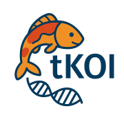

# tKOIAgent: Transcriptomic Knowledge Organization & Integration Agent 

<br>

## Overview

**tKOIAgent** transforms Claude Desktop into an intelligent research assistant for RNA sequencing analysis by connecting your transcriptomic data with comprehensive biomedical knowledge graphs. Contextualize gene expression results through network-based exploration of biological processes, diseases, pathways, and molecular interactions.

> **Platform Support**: Currently available for **macOS only**. Windows and Linux support coming soon.

### Key Features

- **Knowledge Graph Integration** - Direct access to biomedical knowledge graphs containing millions of biological relationships
- **Context-Aware Analysis** - All results interpreted within your specific study context
- **Flexible Querying** - Claude constructs custom Cypher queries based on your data and questions
- **Lightweight Design** - Agent handles knowledge graph queries; Claude manages data analysis
- **No Data Upload** - Your transcriptomic data stays in Claude Desktop; only concepts are queried against the knowledge graph

## Prerequisites

### System Requirements
- **Claude Desktop** 1.0.0+ with DXT support
- **Operating System**: **macOS 11+ only** (Windows and Linux support coming soon)
- **Python** 3.10+ with [uv package manager](https://docs.astral.sh/uv/)
- **Memory**: 8GB RAM minimum
- **Network**: Access to knowledge graph server

### Install Required Software

**1. Download and Install Claude Desktop**

Visit [claude.ai/download](https://claude.ai/download) to download Claude Desktop for macOS.

**Installation Steps:**
1. Download the `.dmg` installer file
2. Open the downloaded file
3. Drag the Claude app to your Applications folder
4. Open Claude from Applications
5. Sign in with your Anthropic account
6. Verify you have Claude Desktop version 1.0.0 or later (Check: Claude menu → About Claude)

**2. Install UV Package Manager**

UV is a fast Python package manager required to run tKOIAgent.

**Step-by-step installation:**

1. **Install Homebrew** (if not already installed)

   Open Terminal and run:
   ```bash
   /bin/bash -c "$(curl -fsSL https://raw.githubusercontent.com/Homebrew/install/HEAD/install.sh)"
   ```
   
   Follow the on-screen instructions to complete Homebrew installation.

2. **Deactivate any Python virtual environments**

   If you're using conda or other virtual environments:
   ```bash
   conda deactivate
   # or
   deactivate
   ```

3. **Check your Python version**

   ```bash
   python3 --version
   ```
   
   You need Python 3.10 or higher. If your version is older, update it:
   ```bash
   brew install python
   ```

4. **Install UV**

   ```bash
   brew install uv
   ```

5. **Verify UV installation**

   ```bash
   uv --version
   ```
   
   You should see output like `uv 0.x.x` confirming successful installation.

## Installation

### Quick Install (3 Easy Steps)

**Step 1: Download the Extension**

1. Go to the [Releases](../../releases) page
2. Find the latest release
3. Download the `tKOIAgent.dxt` file to your Downloads folder

**Step 2: Install in Claude Desktop**

There are two ways to install the extension:

**Method A: Drag and Drop (Recommended)**

1. Open Claude Desktop
2. Locate the downloaded `tKOIAgent.dxt` file in your Downloads folder
3. **Drag and drop** the `.dxt` file directly into the Claude Desktop window
4. Claude will automatically detect the extension and show an installation prompt
5. Click **"Install"** in the dialog that appears
6. Wait for installation to complete (usually takes 30-60 seconds)

**Method B: Double-Click**

1. Locate the downloaded `tKOIAgent.dxt` file
2. **Double-click** the file
3. Claude Desktop will open automatically with the installation dialog
4. Click **"Install"**
5. Wait for installation to complete

**Step 3: Verify Installation**

1. In Claude Desktop, start a new conversation
2. Look for the 🧬 icon or "tKOIAgent" in your available tools/extensions panel
3. You should see tools like `describe_study` and `query_knowledge_graph`
4. If you see these tools, installation was successful!

**Troubleshooting Installation:**

- **"Extension not recognized"**: Make sure you downloaded the `.dxt` file and not a `.zip` or other archive
- **Installation hangs**: Restart Claude Desktop and try again
- **Tools not appearing**: Check that UV is installed correctly (`uv --version` in Terminal)
- **Permission errors**: Ensure Claude Desktop has necessary permissions in System Preferences → Privacy & Security

That's it! The knowledge graph connection is pre-configured - no additional setup required.

## Workflow

### Step 1: Prepare Your Data

Upload your RNA-seq analysis results to Claude Desktop as an Excel file. Your file should contain:

- **Biological processes** (from GO enrichment analysis)
- **Gene lists** (differentially expressed genes)
- **Other annotations** (pathways, cell types, anatomical regions)
- Multiple tabs for different analyses or comparisons

**Example file structure:**
```
Tab 1: Upregulated Processes
- BiologicalProcess | Adjusted P-value | Gene Count

Tab 2: Downregulated Processes  
- BiologicalProcess | Adjusted P-value | Gene Count

Tab 3: DEG List
- Gene Symbol | Log2FC | P-value
```

### Step 2: Describe Your Study

**This is required before any knowledge graph queries.** Provide Claude with:

- Study objectives and research questions
- Biological context (tissue, cell type, organism)
- Experimental design (what conditions are being compared)
- What you're trying to understand

**Example:**
```
"This is a differential gene expression study comparing liver tissue from 
high-fat diet vs. normal diet mice after 12 weeks. We're investigating 
metabolic dysfunction and want to understand which inflammatory and 
metabolic processes are dysregulated in obesity-induced hepatic steatosis."
```

### Step 3: Let Claude Analyze

Claude will automatically:
1. Read and parse your Excel file
2. Summarize significant results from each tab
3. Identify key biological processes and genes
4. Query the knowledge graph to contextualize findings
5. Interpret results within your study context

### Step 4: Interactive Exploration

Ask follow-up questions to dive deeper:

```
"What diseases are connected to these inflammatory processes?"

"Find therapeutic compounds that target these dysregulated pathways"

"How do these processes connect to insulin signaling?"

"What genes are shared across multiple enriched processes?"
```

## Usage Examples

### Contextualize Biological Processes
```
After uploading your GO enrichment results:

"I've uploaded my enrichment analysis. This study examines synaptic 
dysfunction in Alzheimer's disease using hippocampal neurons. Please 
analyze the biological processes and explain their relevance to AD 
pathology using the knowledge graph."
```

Claude will:
- Extract biological processes from your file
- Query connections to Alzheimer's disease
- Identify relevant genes, proteins, and pathways
- Explain mechanistic links to your phenotype

### Disease Mechanism Investigation
```
"Which of the enriched processes in my data are directly connected to 
rheumatoid arthritis in the knowledge graph? Show me the genes and 
pathways that link them."
```

### Drug Target Discovery
```
"Find compounds in the knowledge graph that interact with proteins involved 
in the top 10 biological processes from my analysis. Prioritize FDA-approved 
drugs."
```

### Cross-Tissue Comparison
```
"My study shows these processes are dysregulated in cardiac tissue. Are 
these same processes implicated in other cardiovascular diseases? What 
does the knowledge graph reveal about tissue-specific effects?"
```

### Pathway Analysis
```
"Connect the biological processes from my Excel file to KEGG pathways in 
the knowledge graph. Which signaling cascades are most affected?"
```

## How It Works

### Architecture

```
┌─────────────────┐
│  Your Excel     │
│  RNA-seq Data   │
└────────┬────────┘
         │
         ▼
┌─────────────────┐      ┌──────────────────┐
│  Claude         │◄────►│  tKOIAgent       │
│  Desktop        │      │  (MCP Server)    │
│                 │      └─────────┬────────┘
│  • Reads Excel  │                │
│  • Summarizes   │                │
│  • Constructs   │                ▼
│    queries      │      ┌──────────────────┐
│  • Interprets   │      │  Knowledge Graph │
│    results      │      │  (Neo4j)         │
└─────────────────┘      │                  │
                         │  • Genes         │
                         │  • Proteins      │
                         │  • Diseases      │
                         │  • Compounds     │
                         │  • Pathways      │
                         │  • Processes     │
                         └──────────────────┘
```

### Agent Design Philosophy

**tKOIAgent is intentionally minimal:**

- **No data processing** - Claude handles Excel parsing and statistical analysis
- **No hardcoded workflows** - Claude decides what queries to run based on your data
- **Study-context enforcement** - Requires study description before allowing queries
- **Pure query interface** - Provides clean access to knowledge graph via Cypher

This design maximizes flexibility while ensuring biological context is never lost.

### Available Tools

| Tool | Description | When to Use |
|------|-------------|-------------|
| `describe_study` | Record study context | **Required first step** before any analysis |
| `query_knowledge_graph` | Execute Cypher queries | Main tool for exploring biological connections |
| `get_knowledge_graph_schema` | View graph structure | Optional - helpful for understanding available data types |
| `get_workflow_status` | Check progress | Troubleshooting and status checks |

## Knowledge Graph Contents

The biomedical knowledge graph contains:

- **Biological Processes** - Gene Ontology (GO) terms and relationships
- **Genes & Proteins** - Human and model organism genes with functional annotations
- **Diseases** - Disease ontology with gene-disease associations
- **Compounds** - Small molecules, drugs, and their targets
- **Pathways** - KEGG, Reactome, and other pathway databases
- **Anatomy** - Anatomical structures and tissue types
- **Cell Types** - Cell type ontology and markers

**Relationships include:**
- Gene-process associations
- Protein-protein interactions
- Drug-target interactions
- Disease-gene associations
- Pathway memberships
- And many more...

## Advanced Usage

### Custom Cypher Queries

Claude constructs Cypher queries automatically, but you can guide the exploration:

```
"Use a multi-hop query to find compounds that target proteins in the 
'inflammatory response' process, then check if those compounds are 
associated with reduced disease severity in any inflammatory diseases."
```

### Batch Analysis

```
"For each biological process in my Excel file (all 50 of them), query 
the knowledge graph to find: 1) associated diseases, 2) number of 
connected genes, 3) any FDA-approved drugs targeting those genes. 
Summarize in a table."
```

### Integration with Literature

```
"Based on the knowledge graph connections, what are the most promising 
mechanistic hypotheses for why these processes are dysregulated in my 
study? Search for supporting literature."
```

## Troubleshooting

### Study Description Required Error
**Symptom**: "You must call describe_study first before querying the knowledge graph"

**Solution**: Always describe your study before analysis:
```
"This is a study examining [condition] in [tissue/cell type]. 
We compared [condition A] vs [condition B] and want to understand 
[research question]."
```

### No Results Found
**Symptom**: Query returns empty results

**Possible causes:**
1. Process names don't match knowledge graph terminology
   - Try broader terms (e.g., "inflammation" vs "acute inflammatory response")
2. Typos in biological process names
3. Process not present in knowledge graph

**Solution**: Ask Claude to try alternative queries or broader terms

### Connection Issues
**Symptom**: "Knowledge graph connection failed"

**Check:**
1. Internet connection is active
2. Firewall allows outbound connections to port 7687
3. Knowledge graph server is operational

### Performance Issues
**Symptom**: Slow query responses

**Solutions:**
1. Limit query complexity (avoid 4+ hop paths)
2. Add LIMIT clauses to queries
3. Query specific processes rather than all at once
4. Use more specific search terms

## Privacy & Security

- **Your data stays local** - Excel files are processed entirely in Claude Desktop
- **Only concepts are queried** - Gene names and biological terms are sent to the knowledge graph, not raw expression data
- **No data storage** - The agent doesn't store your files or results
- **Read-only access** - Agent can only query the knowledge graph, not modify it

## Best Practices

### For Best Results

1. **Be specific in study descriptions** - More context = better interpretations
2. **Upload clean data** - Remove extra headers, ensure consistent column names
3. **Start broad, then narrow** - Initial queries should cast a wide net
4. **Verify process names** - Check that biological process names match GO terminology
5. **Ask for summaries first** - Let Claude overview your data before deep dives

### Common Patterns

**Process → Disease Links:**
```
"Which diseases are associated with [biological process] according to 
the knowledge graph?"
```

**Gene → Pathway Context:**
```
"For the genes in [biological process], show me which pathways they 
participate in and how those pathways relate to [phenotype]."
```

**Compound Discovery:**
```
"Find compounds that modulate [biological process] and check their 
clinical trial status."
```

## Limitations

- **Knowledge graph completeness** - Not all biological relationships are captured; annotation is ongoing
- **Context interpretation** - Claude interprets results but can't replace domain expertise
- **Hypothesis generation** - Tool suggests connections but doesn't prove causality
- **Current as of knowledge graph version** - Biological knowledge is constantly evolving

## Citation

If you use tKOIAgent in your research, please cite:

```
tKOIAgent: Transcriptomic Knowledge Organization & Integration Agent
Wanjun Gu, Baranzini Lab, UCSF
https://github.com/BaranziniLab/tKOIAgent
```

## License

tKOIAgent is released under the [MIT License](LICENSE).

## Authors and Maintainers

**tKOIAgent** is developed and maintained by the [Baranzini Lab](https://baranzinilab.ucsf.edu/) at UCSF.

- **Wanjun Gu** - [wanjun.gu@ucsf.edu](mailto:wanjun.gu@ucsf.edu)

## Acknowledgments

- **SPOKE Knowledge Graph** - Comprehensive biomedical knowledge integration
- **Anthropic Claude** - AI-powered analysis and interpretation
- **Model Context Protocol** - Enabling seamless tool integration
- **Neo4j** - Graph database powering knowledge exploration

## Support

- **Documentation**: This README and inline tool descriptions
- **Bug Reports**: [Create an issue](../../issues)
- **Feature Requests**: [Open a discussion](../../discussions)
- **Questions**: Contact [wanjun.gu@ucsf.edu](mailto:wanjun.gu@ucsf.edu)

---

<div align="center">
  <p><a href="../../releases">Download tKOIAgent</a> | <a href="../../issues">Report Issues</a> | <a href="mailto:wanjun.gu@ucsf.edu">Contact</a></p>
</div>